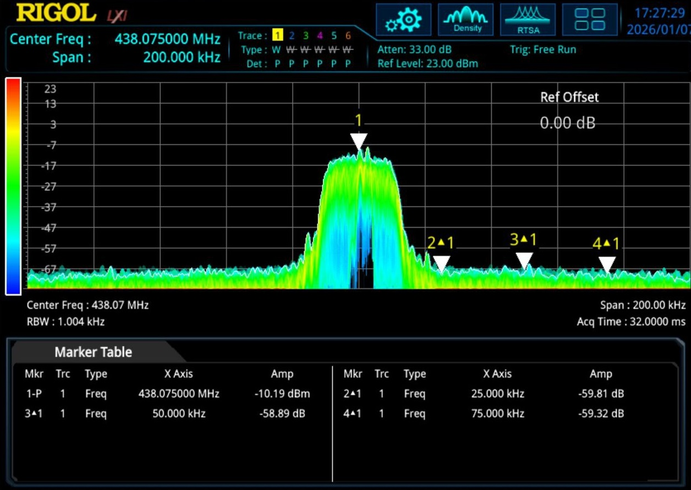
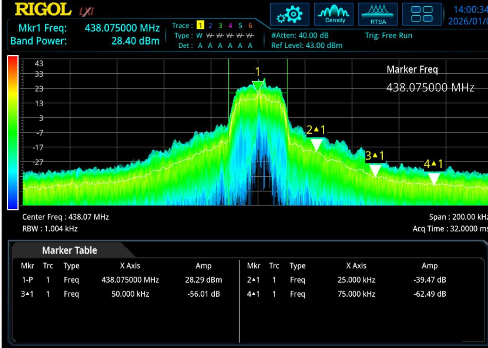
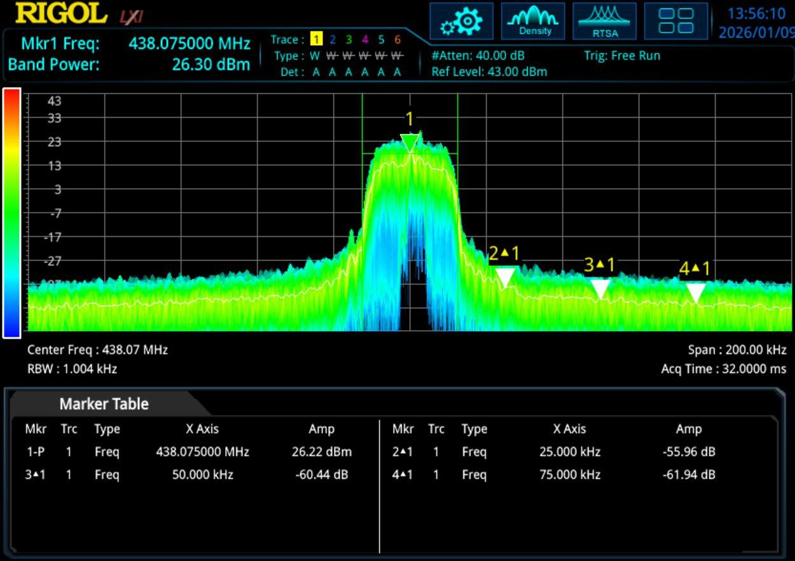

# Amplifying the SDR output signal

Most SDRs are not designed to directly drive a TETRA transmitter chain at operational power levels. External amplification is therefore sometimes considered.

> ⚠Please note:  
> The information below is intentionally high-level and provided for orientation only.  
> In many small experimental setups (e.g. lab testing, very short-range work, hotspot-style use), typical SDR output levels are often already sufficient.  
> Adding external amplification should only be considered after a careful assessment of the points below, and with appropriate RF measurement equipment and regulatory awareness as incorrect amplification can easily result in out-of-band emissions, even if the baseband signal itself is correct.

When experimenting, it is strongly recommended to:
- Start at very low output power  
- Use a spectrum analyser to verify spectral purity  
- Ensure compliance with local regulatory limits  

## Practical example: linearity and adjacent channel power

The following examples show that amplification is possible, but linearity quickly becomes the critical factor.  
The primary issue is usually not harmonic distortion, but rather inter-channel interference, commonly observed as increased adjacent channel power (ACP).

As an RF power amplifier is driven closer to its P1dB point (the output power level at which gain compression begins), non-linear effects increase rapidly. Even if the carrier itself still appears “clean”, energy spreads into adjacent channels.

### Example: direct SDR output

Below is an example of the direct RF output from an SxCeiver, without external amplification:

> *(spectrum capture of direct SxCeiver output)*  

In this configuration, spectral purity is generally good, and adjacent channels remain largely unaffected.

### Example: excessive drive level (near P1dB)

If the output level is pushed too far, approaching the amplifier’s P1dB point, the situation changes noticeably:

> *(spectrum capture with high drive level)*  

In this case, adjacent channels are clearly impacted, even though the baseband signal itself has not changed. This is a classic symptom of insufficient linearity.

### How commercial TETRA transmitters handle amplification

In practice, a TETRA amplification stage typically follows these guidelines:

- Operates far below the P1dB point, by deliberately oversizing the amplifier (e.g. using a 10 W-rated amplifier to produce only 1 W RF output)
- Favors Class A or Class AB operation (one reason why TETRA transmitter efficiency rarely exceeds ~20%)
- Uses a linearization loop, often referred to as a Cartesian loop, to measure distortion and pre-correct the signal so that non-linear effects cancel out

These measures are combined with tight filtering and closed-loop power control.

### Practical note for experimental and amateur use

For most experimental, lab, or radio-amateur scenarios, operating well below the P1dB point already yields acceptable results. 

> *(14-18dBm output, with low spectral spreading)*  

In this example, close to 1 W of RF output is achieved while keeping adjacent-channel spectral spreading at a reasonable level.

This setup is shown for illustration only and is consistent with the disclaimer above: amplification was only introduced after measurement and conservative gain staging.

Two separate amplification stages were used in this case:

- an SPF5189-based gain module, providing roughly +10 dBm output on its own  
- a commercial final amplifier module originally intended for a TETRA repeater setup  

The SPF5189 stage alone already provides useful gain, but also produces harmonics and broadband artifacts. These are not acceptable by themselves and were mitigated by the filtering present in the commercial final stage.

The final stage does provide about 15dB of gain, but draws a standby current of around 2A (with a non-negligible thermal dissipation needed).

This example illustrates that even modest amplification can introduce unwanted spectral components, and that filtering and measurement are as important as the gain itself.

## References
Here are some more documentation on this specific issue:

- “TETRA” (Wikipedia - Chapter "Technical Aspects"). Details modulation scheme and why linear amplification is required. https://en.wikipedia.org/wiki/TETRA
- “Distortion in RF Power Amplifiers” (PDF). Explains spectral regrowth and nonlinearity in RF amplifiers. https://gctjaipur.files.wordpress.com/2015/08/distortion-in-rf-power-amplifiers-ebook-lib.pdf
- Ahmed, A. “Feedback Linearization of RF Power Amplifier for Wireless Systems” (article). Discusses adjacent channel power ratio (ACPR), EVM, and linearization approaches. https://beei.org/index.php/EEI/article/download/276/186
- Briffa, M. A. *Linearization of RF Power Amplifiers* (PhD thesis). Includes treatment of Cartesian feedback linearization. https://vuir.vu.edu.au/374/7/BRIFFA%20Mark-thesis_nosignature.pdf